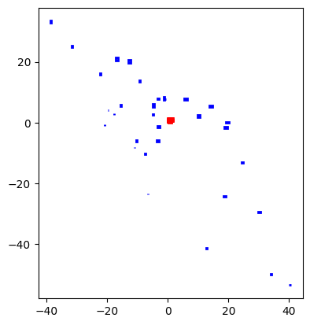
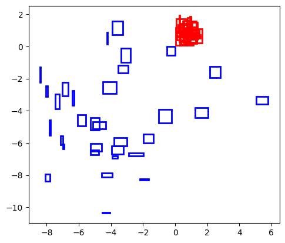

# deep-organize
Experiments in organizing objects using direct optimization with deep neural networks.

## To run
Running using transformer models

```
python examples/organize.py
```

```
python examples/organize.py network=boxes batch_size=256 lr=1e-2 data.num_samples=100 network.loss=regional_2d data.num_rectangles=20 network.layers=8 network.bias=false
```

## Examples
Simple example, using a transformer to re-arrange boxes so they don't overlap. The original boxes are in red, stacked on top of one another. We feed in an arbitrary number of boxes for training. Without additional constraints, they can spread out however
```
python examples/organize.py network=boxes batch_size=256 lr=1e-2 data.num_samples=100 network.loss=overlap_2d data.num_rectangles=20 network.layers=4 network.bias=false
```


Adding a distance constraint as well and the boxes pack a little bit closer
```
python examples/organize.py network=boxes batch_size=256 lr=1e-2 data.num_samples=100 network.loss=regional_2d data.num_rectangles=20 network.layers=4 network.bias=false network.alpha=0.001
```

